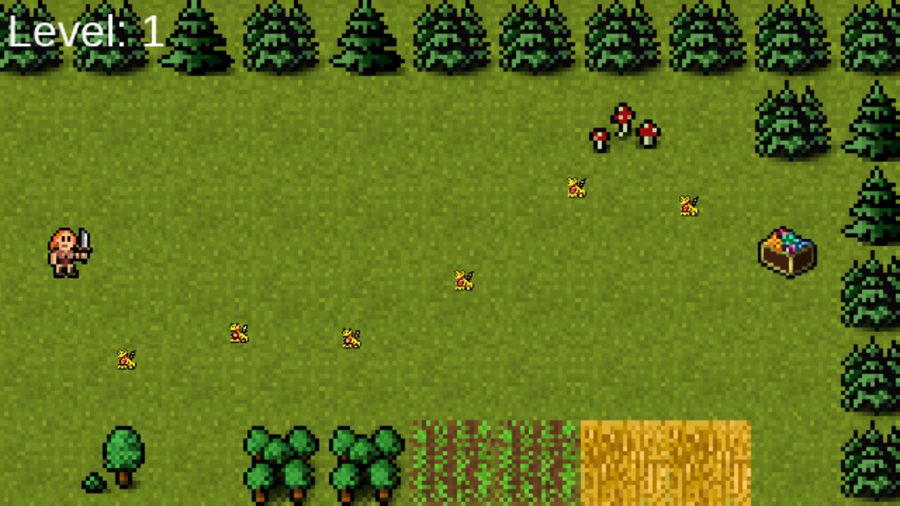
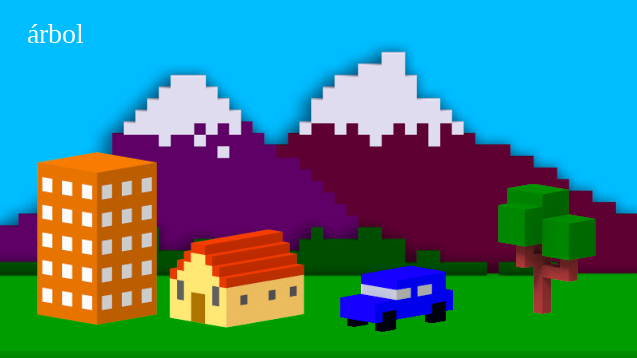
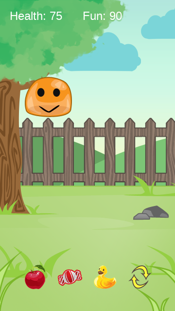
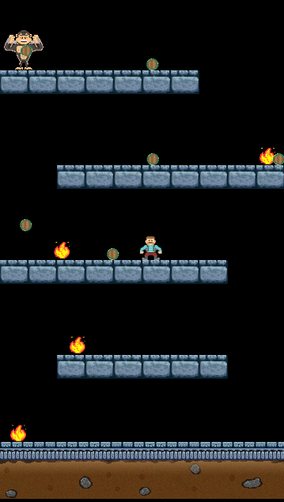

# Learning Phaser 3
[Phaser 3](https://github.com/photonstorm/phaser) is an open source HTML5 game framework that I've been wanting to learn for some time now. I've been having trouble getting started with the framework so I purchased the [HTML5 Game Development Mini-Degree](https://academy.zenva.com/product/html5-game-phaser-mini-degree/) course from the people at Zenva Academy to help speed up my learning and give me a solid foundation to work from. This repository is the result of my time going through their courses.

## [Road Crossing Game](https://kenny-designs.github.io/phaser-course/roadCrossingGame/game/)

Try and steal as much treasure as you can while avoiding dragons by holding down the left mouse button, or touch the screen, to move your character across the screen.

## [Spanish Learning Game](https://kenny-designs.github.io/phaser-course/spanishLearningGame/game/)

Click the object that goes with the word said in Spanish.

## [Virtual Pet Game](https://kenny-designs.github.io/phaser-course/virtualPetGame/game/)

Keep your pet happy and well-fed or else they'll die! Simply click, or touch, the item you wish to give them then click where you want it in the scene and they'll rush right to it! Careful though, if your pet's health or fun reaches zero they'll die :(

## [Mario Platformer Game](https://kenny-designs.github.io/phaser-course/marioPlatformerGame/game/)

Avoid fire and barrels to reach the monkey at the top of the stage and win the game! Move with the WASD keys and jump with spacebar.

